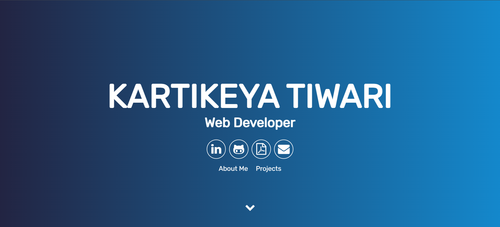
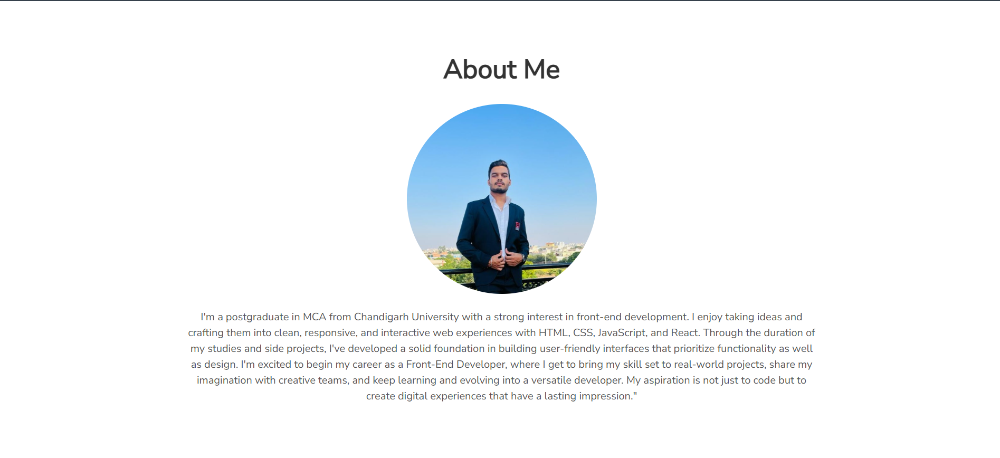
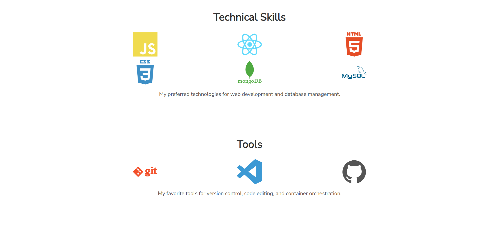
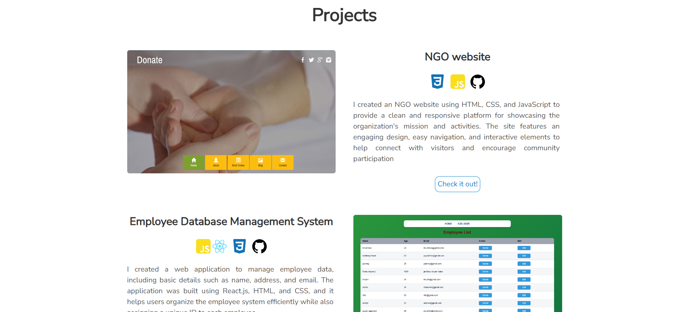

Personal Portfolio - Kartikeya Tiwari
Overview

This is a personal portfolio website for Kartikeya Tiwari, showcasing skills, projects, and contact information. The portfolio is designed using HTML, CSS, and JavaScript, with interactive elements to provide a smooth user experience. A favicon is included for branding and better browser tab visibility.

Features

Responsive Design: Optimized for desktops, tablets, and mobile devices.

Interactive Header: Includes links to LinkedIn, GitHub, and downloadable résumé.

Custom Styling: Built with CSS for modern and clean aesthetics.

JavaScript Animations: Smooth animations and effects for enhanced user experience.

Favicon: Personalized icon displayed in the browser tab.

images:

Technologies Used

HTML5: Structure and content of the website.

CSS3: Styling, layout, and responsive design.

JavaScript: Interactivity and animations.

Font Awesome: Social and functional icons.

Favicon: Custom browser icon for branding.
